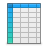

# Faba Extra Icons

[](https://creativecommons.org/licenses/by-sa/4.0/)
[](https://www.gnu.org/licenses/lgpl-3.0.en.html)

Custom icons for Faba Icon Theme of the [Moka Project](https://snwh.org/moka) made by [Sam Hewitt](http://snwh.org/).





Faba Icon Theme (the icon assets and sources) are licensed under a [GNU Lesser General Public License 3.0](https://www.gnu.org/licenses/lgpl-3.0.en.html) license.

Any bundled software is free software; you can redistribute it and/or modify it under the terms of the GNU General Public License as published by the Free Software Foundation; either version 3, or (at your option) any later version.

## Downloading the original Icon Theme

The original source for Faba Icon Theme can be found [here](https://github.com/snwh/faba-icon-theme). You can clone the latest version from the git repository:

	git clone https://github.com/snwh/faba-icon-theme.git

## Installation

Simple, you just run the script from the root of the source folder:
```bash
./INSTALL
```
